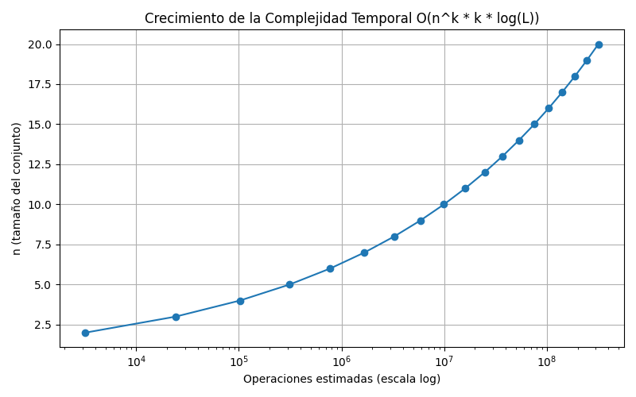
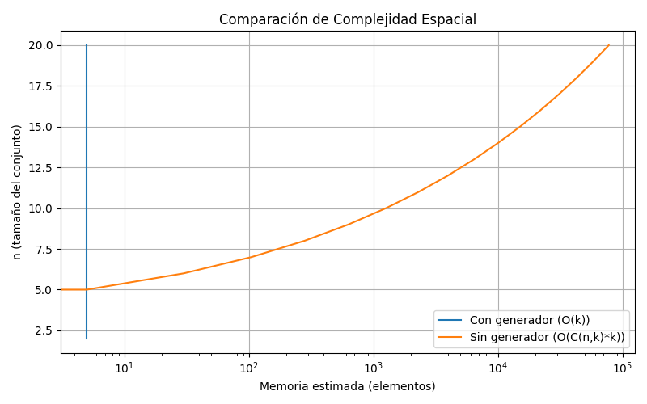

# Presentación: LCM Prime Factor Covering como Problema NP-Completo

**Tema:** LCM Prime Factor Covering (Cobertura de Factores Primos con LCM)

---

## 1. Fundamentos Matemáticos: Least Common Multiple (LCM)

El Least Common Multiple (LCM, en español Mínimo Común Múltiplo o MCM) es un concepto matemático fundamental que nos ayuda a encontrar el número más pequeño que es múltiplo de dos o más números. Por ejemplo, el LCM de 6 y 10 es 30, ya que es el número más pequeño que es divisible tanto por 6 como por 10.

### 1.1. Métodos para Calcular el LCM

#### A. Método por Descomposición en Factores Primos
- Descomponer cada número en sus factores primos
- Tomar cada factor primo el mayor número de veces que aparezca
- Multiplicar todos estos factores

**Ejemplo:** LCM(6, 10)
- 6 = 2 × 3
- 10 = 2 × 5
- LCM = 2 × 3 × 5 = 30

#### B. Método por División
- Dividir los números por sus factores primos comunes
- Continuar hasta que no haya más divisores comunes
- Multiplicar todos los divisores y los números restantes

**Ejemplo:** LCM(10, 14)
```
10, 14 | 2
 5,  7 | 5
 1,  7 | 7
 1,  1
LCM = 2 × 5 × 7 = 70
```

#### C. Método usando el GCD (Greatest Common Divisor)
- Usar la fórmula: LCM(a,b) = (a × b) ÷ GCD(a,b)

**Ejemplo:** LCM(14, 35)
- GCD(14, 35) = 7
- LCM = (14 × 35) ÷ 7 = 70

### 1.2. Propiedades Importantes del LCM

- El LCM de dos números siempre es mayor o igual que ambos números
- El LCM de dos números primos entre sí es su producto
- El LCM es asociativo: LCM(a,b,c) = LCM(LCM(a,b),c)
- Para cualquier número a: LCM(a,a) = a
- El LCM está relacionado con el GCD por la fórmula: a × b = GCD(a,b) × LCM(a,b)

### 1.3. En el Contexto de este Problema

El LCM juega un papel crucial en nuestro problema de cobertura de factores primos, ya que necesitamos encontrar un subconjunto de números cuyo LCM sea divisible por un número objetivo T. Esto implica que todos los factores primos de T deben estar presentes (con al menos la misma multiplicidad) en el LCM del subconjunto seleccionado.

---

## 2. Planteamiento del Problema LCM-PFC

### 2.1. Descripción Informal

Dado un conjunto de números, un número objetivo T y un límite k, ¿podemos elegir como máximo k números del conjunto de tal manera que su Least Common Multiple (LCM) sea divisible por T? En esencia, se busca "cubrir" todos los factores primos de T usando los factores de un pequeño subconjunto de números.

### 2.2. Formulación Formal

**ENTRADA:**
1. Un conjunto de enteros positivos S = {a₁, a₂, ..., aₙ}
2. Un entero objetivo T > 0
3. Un entero k (1 ≤ k ≤ n)

**PREGUNTA:** ¿Existe un subconjunto S' ⊆ S tal que |S'| ≤ k y T | LCM(S')?

*(La notación "T | LCM(S')" significa "T divide a LCM(S')")*

### 2.3. Ejemplo Ilustrativo

**Datos:**
- S = {6, 10, 14, 35}
- T = 70 (cuyos factores primos son 2, 5, 7)
- k = 2

**Pregunta:** ¿Podemos elegir 2 números de S cuyo LCM sea divisible por 70?

**Análisis de todos los subconjuntos de tamaño 2:**

- **S' = {6, 10}** → LCM(6, 10) = LCM(2×3, 2×5) = 30
  - 30 no es divisible por 70. ❌ No sirve.

- **S' = {6, 14}** → LCM(6, 14) = LCM(2×3, 2×7) = 42
  - 42 no es divisible por 70. ❌ No sirve.

- **S' = {6, 35}** → LCM(6, 35) = LCM(2×3, 5×7) = 210
  - 210 es divisible por 70. ✅ Sí sirve! (aunque es más grande de lo necesario)

- **S' = {10, 14}** → LCM(10, 14) = LCM(2×5, 2×7) = 70
  - 70 es divisible por 70. ✅ Sí sirve! (solución óptima)

- **S' = {10, 35}** → LCM(10, 35) = LCM(2×5, 5×7) = 70
  - 70 es divisible por 70. ✅ Sí sirve! (solución óptima)

- **S' = {14, 35}** → LCM(14, 35) = LCM(2×7, 5×7) = 70
  - 70 es divisible por 70. ✅ Sí sirve! (solución óptima)

**Respuesta:** SÍ, porque existen varios subconjuntos de tamaño 2 que cumplen la condición. De hecho, encontramos cuatro soluciones válidas, donde tres de ellas ({10,14}, {10,35}, {14,35}) son óptimas pues su LCM es exactamente 70.

---

## 3. Demostración de NP-Completitud

### 3.1. Demostración de que LCM-PFC está en NP

Para demostrar que LCM-PFC está en NP, debemos mostrar que una solución candidata (un "certificado") se puede verificar en tiempo polinomial.

**Certificado:** Un subconjunto S' ⊆ S con |S'| ≤ k.

**Verificador:**
1. Comprobar que |S'| ≤ k. *(Tiempo: O(k))*
2. Calcular el LCM de todos los elementos en S'. *(Tiempo polinomial, O(k * log(max(S'))))*
3. Comprobar si T divide al LCM(S') calculado. *(Tiempo polinomial, usando una simple operación de módulo)*

**Complejidad del verificador:** La verificación es la suma de estos pasos, lo cual es claramente polinomial en el tamaño de la entrada.

**Conclusión:** Por lo tanto, LCM-PFC pertenece a la clase NP.

### 3.2. Demostración de que LCM-PFC es NP-Duro

Para demostrar que es NP-duro, lo reduciremos desde el problema SET COVER (Cobertura de Conjuntos), un problema NP-completo clásico.

#### A. Definición de SET COVER

**ENTRADA:**
1. Un universo finito de elementos U = {u₁, u₂, ..., uₘ}
2. Una colección de subconjuntos de U, C = {C₁, C₂, ..., Cₙ}
3. Un entero k

**PREGUNTA:** ¿Existe una subcolección C' ⊆ C con |C'| ≤ k tal que la unión de los conjuntos en C' sea igual a U?

#### B. Construcción de la Transformación

Dada una instancia de SET COVER (U, C, k), construimos una instancia de LCM-PFC (S, T, k') de la siguiente manera:

1. **Asignar primos:** A cada elemento uᵢ ∈ U, le asignamos un número primo único pᵢ.

2. **Construir el objetivo T:** T es el producto de todos los primos asignados a los elementos de U (es decir, un número libre de cuadrados).
   ```
   T = p₁ * p₂ * ... * pₘ
   ```

3. **Construir el conjunto S:** Para cada conjunto Cⱼ ∈ C, creamos un número aⱼ en S. Este número es el producto de los primos correspondientes a los elementos en Cⱼ.
   ```
   Si Cⱼ = {uₐ, uᵦ, ...}, entonces aⱼ = pₐ * pᵦ * ...
   ```
   El conjunto S será {a₁, a₂, ..., aₙ}.

4. **Establecer el límite k':** El límite para LCM-PFC es el mismo que para SET COVER, k' = k.

#### C. Demostración de que la Transformación es Válida

**(⇒) Si existe una cobertura de conjuntos C' de tamaño ≤ k:**
- Sea C' = {Cⱼ₁, ..., Cⱼᵣ} donde r ≤ k.
- Por definición de cobertura, la unión de estos conjuntos es U.
- Consideremos el subconjunto S' = {aⱼ₁, ..., aⱼᵣ} en el problema LCM-PFC.
- El LCM(S') contendrá como factor a cada primo pᵢ correspondiente a un uᵢ ∈ U, porque cada uᵢ está en al menos un conjunto de C'.
- Por lo tanto, el producto de todos los primos p₁, ..., pₘ (que es T) debe dividir a LCM(S').
- Como |S'| = r ≤ k, hemos encontrado una solución para LCM-PFC.

**(⇐) Si existe una solución S' para LCM-PFC de tamaño ≤ k:**
- Sea S' = {aⱼ₁, ..., aⱼᵣ} donde r ≤ k.
- La condición es que T | LCM(S'). Esto significa que cada factor primo pᵢ de T debe ser también un factor primo de LCM(S').
- Para que pᵢ sea un factor de LCM(S'), debe ser un factor de al menos un aⱼ en S'.
- Esto implica que el elemento uᵢ correspondiente está en el conjunto Cⱼ.
- Por lo tanto, la unión de los conjuntos Cⱼ correspondientes a los aⱼ en S' debe contener a todos los elementos uᵢ de U.
- Hemos encontrado una cobertura de conjuntos C' de tamaño r ≤ k.

---

## 4. Análisis de Complejidad

### 4.1. Complejidad Temporal: O(n^k * k * log(L))

**Desglose detallado de la complejidad:**
- **O(n^k):** Corresponde al número de subconjuntos posibles de tamaño k que se pueden formar a partir de n elementos. Este término domina el crecimiento de la complejidad, ya que el número de combinaciones crece exponencialmente con k.
- **k:** Para cada subconjunto, es necesario calcular el LCM de k números. Esto implica realizar k-1 operaciones de LCM (cada una usando el GCD), por lo que el costo de procesar cada subconjunto es proporcional a k.
- **log(L):** Cada operación de LCM/GCD tiene un costo logarítmico respecto al tamaño de los números involucrados, donde L es el valor máximo que puede alcanzar el LCM.

**Fórmula completa:**
- El tiempo total es aproximadamente:  
  **O(n^k * k * log(L))**

**¿Se puede simplificar?**
- En muchos textos y contextos, cuando se busca dar una idea general del crecimiento y no se requiere precisión absoluta, se puede omitir el factor k y escribir la complejidad como **O(n^k * log(L))**. Esto es válido porque, para valores grandes de n y k, el término n^k domina completamente sobre k.
- **Sin embargo**, para un análisis riguroso y comparativo, es preferible mantener la versión detallada **O(n^k * k * log(L))**, ya que muestra explícitamente el costo de calcular el LCM de cada subconjunto.

**Ejemplo práctico:**
- Si n = 10 y k = 3, hay 120 subconjuntos posibles (C(10,3)), y para cada uno se hacen 2 operaciones de LCM, cada una con costo logarítmico.
- Si n o k aumentan, el número de subconjuntos crece mucho más rápido que el factor k, pero este último sigue siendo relevante para el costo total.

### 4.2. Complejidad Espacial: O(k + log(L))

**Almacenamiento de subconjuntos (con `itertools`):** `itertools.combinations` es un generador, por lo que no almacena todos los subconjuntos en memoria. Solo se guarda un subconjunto (`s_prime`) a la vez, ocupando un espacio O(k).

**Almacenamiento de números:** El espacio para guardar el LCM calculado (`current_lcm`) depende de su magnitud. Si `L` es el valor máximo del LCM, el espacio requerido es O(log(L)).

**Complejidad Total:** El espacio está dominado por el subconjunto actual y el valor del LCM, resultando en O(k + log(L)), lo cual es polinomial y muy eficiente.

> **NOTA IMPORTANTE (Caso sin generador):** Si en lugar de usar un generador se creara una lista con todas las combinaciones en memoria, la complejidad espacial se dispararía a O(C(n, k) * k), donde C(n, k) es el coeficiente binomial. Para entradas moderadas, esto consumiría gigabytes de RAM y haría que el algoritmo fuera inviable. El uso de `itertools` es, por tanto, crucial para la eficiencia en memoria.

### 4.3. Visualización de la Complejidad

**[GRÁFICA 1]**
- **Título:** Crecimiento de la Complejidad Temporal
- **Descripción:** Gráfica que muestra el crecimiento exponencial O(n^k * k * log(L)) para diferentes valores de n y k fijo.



**[GRÁFICA 2]**
- **Título:** Comparación de Complejidad Espacial
- **Descripción:** Gráfica comparativa entre la implementación con generador O(k + log(L)) y sin generador O(C(n,k) * k).



**[RESULTADOS MATLAB]**
- **Título:** Resultados Matlab
- **Descripción:** Captura de pantalla de los resultados obtenidos en Matlab para el problema LCM-PFC.


---
## 5. Conclusiones

### 5.1. Resultados Principales

- LCM-PFC es NP-completo (está en NP y es NP-duro)
- No se conoce un algoritmo eficiente (de tiempo polinomial) para resolverlo
- Para instancias grandes, las soluciones de fuerza bruta son inviables

### 5.2. Implicaciones Teóricas

- Conexión entre teoría de números (factores primos, LCM) y optimización combinatoria
- Relación con otros problemas NP-completos clásicos como SET COVER

---

## 6. Apéndice: Simbología Matemática

| Símbolo | Significado |
|---------|-------------|
| **S, C, U** | Letras mayúsculas para denotar conjuntos (ej. S = {a₁, a₂, ...}) |
| **aᵢ, uᵢ** | Letras minúsculas con subíndice para denotar elementos de un conjunto |
| **S' ⊆ S** | S' es un subconjunto de S. Puede ser igual a S o contener menos elementos |
| **\|S'\|** | Cardinalidad del conjunto S', es decir, el número de elementos que contiene |
| **k** | Un entero que generalmente representa un límite o tamaño máximo |
| **T \| LCM(S')** | "T divide a LCM(S')". Significa que el resultado de LCM(S') / T es un número entero, o de forma equivalente, LCM(S') % T == 0 |
| **(⇒)** | Símbolo de implicación. "A ⇒ B" significa "Si A es verdadero, entonces B es verdadero" |
| **(⇐)** | Símbolo de implicación inversa. "A ⇐ B" significa "A es verdadero si B es verdadero" |

---

## Autores

Carlos Andrés Teleche

Deiber Alexander Herrera Gamarra

Johan Alejandro Chaves Alvarado

Sebastian Salas Salazar
